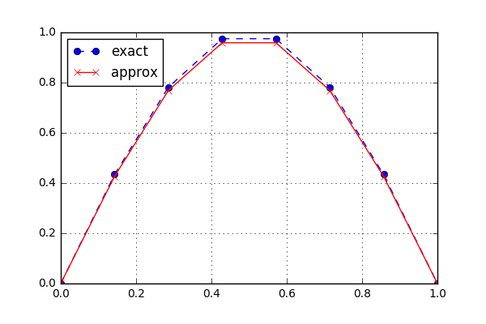

Poisson Equation
================

.. math::
	\begin{cases}
	-\nabla^2 u = f(x) &\text{ in } \Omega \\
	 u = 0 & \text{ on } \partial\Omega
	\end{cases}

1 Dimensional Case
------------------

Example
	>>> import numpy as np
	>>> from mozart.mesh.rectangle import interval
	>>> from mozart.poisson.fem.interval import solve
	>>> f = lambda x: np.pi ** 2 * np.sin(np.pi * x)
	>>> u_D = lambda x: np.zeros_like(x)
	>>> nrElems, degree = (7, 1)
	>>> c4n, n4e, n4db, ind4e = interval(0, 1, nrElems, degree)
	>>> u = solve(c4n, n4e, n4db, ind4e, f, u_D, degree)
	>>> u
	array([ 0.        ,  0.42667492,  0.76884164,  0.95872984,  0.95872984,
        0.76884164,  0.42667492,  0.        ])

.. automodule:: mozart.poisson.fem.interval
   :members: